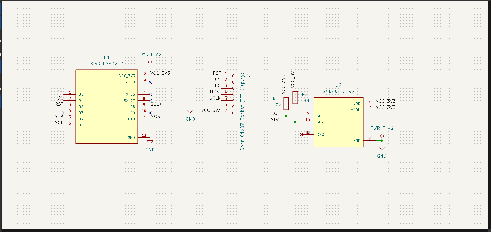
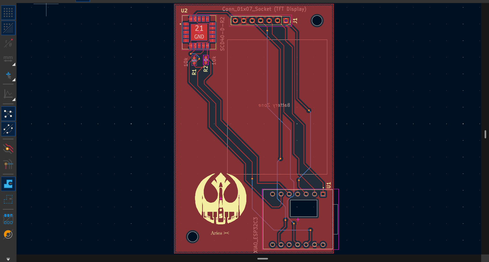
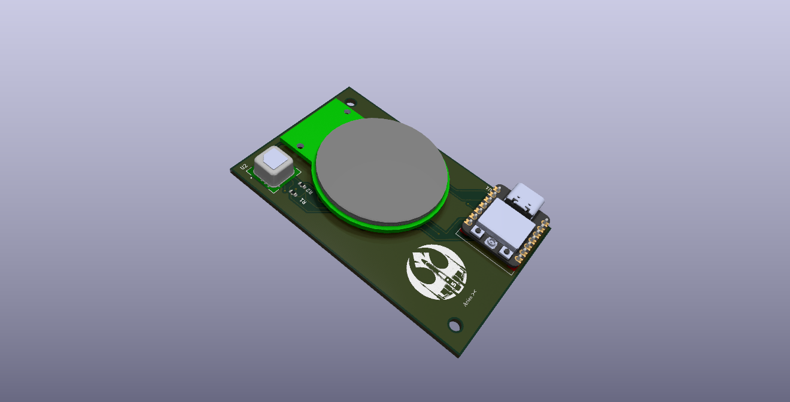
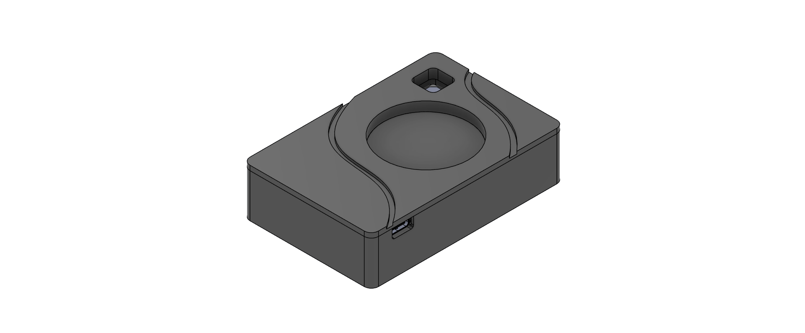
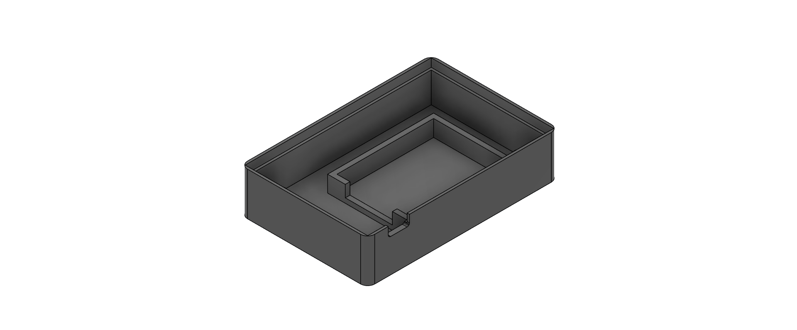
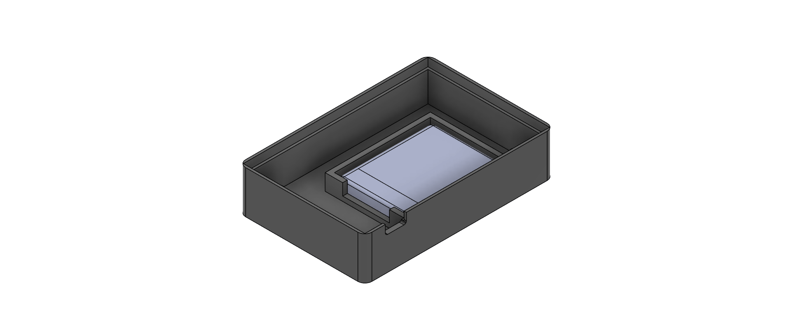
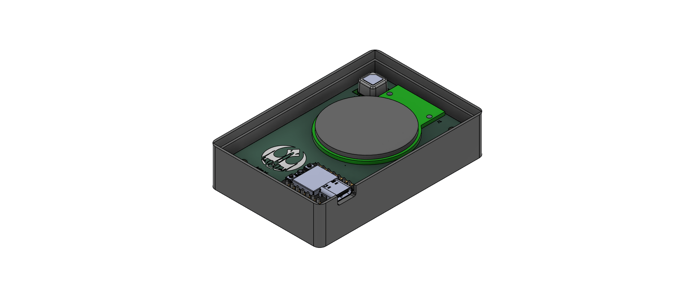
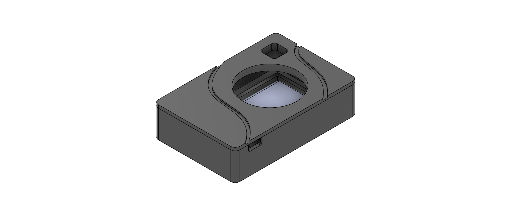

# Aries: Compact CO2 Air Quality Sensor

**Aries** is a compact, battery-powered air quality monitoring device that measures CO₂ levels via a beautiful circular 1.28" TFT display. Built around the **Seeed Studio XIAO ESP32-C3**, it features the Sensirion **SCD40** CO₂ sensor and displays real-time air quality data with WiFi/Bluetooth connectivity.

Went for the name aries beacause i thought it was the Egyptian god of the Air, tunred out the actual name i was looking for was Horus, but i was already in too deep, so i went with Aries.

## Features

- **Real-time CO₂ Monitoring**: Sensirion SCD40 sensor with high accuracy (±50 ppm over 400–2000 ppm)
- **Display**: 1.28" circular GC9A01 TFT display (240×240)
- **Portable**: Runs on a 3.7V LiPo battery (1000 mAh)
- **Smart Power Management**: Slide switch for manual on/off without desoldering
- **Wireless**: WiFi + Bluetooth (BLE 5.0) via ESP32-C3 for data logging or mobile app integration
- **PCB**: 2-layer design optimized for component placement
- **3D-Printed Enclosure**: Base and Lid

## Hardware Overview

### Core Components

| Component | Model | Purpose |
|-----------|-------|---------|
| **Microcontroller** | Seeed XIAO ESP32-C3 | Brain of the device; manages display & sensor |
| **CO₂ Sensor** | Sensirion SCD40-D-R2 | Measures atmospheric CO₂ (I2C interface) |
| **Display** | GC9A01 1.28" TFT | Circular 240×240 RGB display (SPI) |
| **Battery** | 3.7V 1000 mAh LiPo | Portable power (503450 or 603040 form factor) |
| **Power Switch** | Slide/Toggle | On/off control on battery line |

### PCB Design

**Schematic**

**PCB**

### Case Design

The enclosure consists of three 3D-printed parts:

1. **Case** (`aries_casing_full.f3z`): Main body that houses the PCB and display

2. **Base** (`base.f3z`): Bottom mounting plate

3. **Lid** (`lid.f3z`): Top cover with display cutout

## Bill of Materials

| Component | Value | Qty | Part # | Supplier | Price |
|-----------|-------|-----|--------|----------|-------|
| **Microcontroller** |
| Xiao ESP32-C3 | — | 1 | Seeed XIAO ESP32C3 | AliExpress | $4.62 |
| **Sensors** |
| SCD40 CO₂ Sensor | SCD40-D-R2 | 1 | C2684433 | LCSC | — |
| **Display** |
| Circular TFT Display | 1.28" GC9A01 | 1 | — | AliExpress | $2.42 |
| **Power** |
| LiPo Battery | 3.7V 1000mAh | 1 | 503450/603040 | AliExpress | $3.34 |
| **Passive Components** |
| Resistor | 10kΩ (0603) | 2 | — | LCSC | — |
| Capacitor | 1µF (0603) | 4 | — | LCSC | — |
| Capacitor | 100nF (0603) | 2 | — | LCSC | — |
| **Mechanical** |
| Power Switch | Slide/Toggle | 1 | — | Local | $0.50 |
| M2.5 Screws | 10mm | 8 | — | AliExpress | $1.60 |
| JST Connector | PH2.0 2-pin | 1 | — | AliExpress | $0.30 |
| **Manufacturing** |
| PCB (5×) | 2-layer FR4 | — | — | JLCPCB | ~$20 |
| PCBA Assembly | SMT | — | — | JLCPCB | ~$40 |

**Total Component Cost**: ~$13–16 USD (parts only)  
**Total with PCB & Assembly (5 boards)**: ~$75 USD  
**Cost per unit**: ~$15 USD

### Display Guide

A full guide to working with the GC9A01 circular display and ESP32-C3 is available here:  
🔗 [Bench: XIAO ESP32-C3 + 1.28" Circular TFT](https://thesolaruniverse.wordpress.com/2024/04/02/bench-featuring-a-seeed-studio-xiao-esp32-c3-and-a-1-28-spi-gc9a01-circular-tft-display/)

## Inspiration & References

This project draws from several open-source projects and guides:

- **Seeed Studio** - XIAO ESP32-C3 ecosystem and examples
- **Sensirion** - SCD40 sensor datasheet and Arduino library
- **@notaroomba** - GitHub README structure and best practices
- **@GarageTinkering** - 3D CAD enclosure design tutorial ([YouTube](https://www.youtube.com/@GarageTinkering))
- **The Solar Universe Blog** - GC9A01 display integration guide

## Project Status

✅ **PCB Design**: Complete  
✅ **Firmware**: Functional (CO₂ display)  
✅ **3D Models**: Complete  
🔄 **Testing**: In progress  

## License

This project is open-source. Feel free to build, modify, and share!

---
